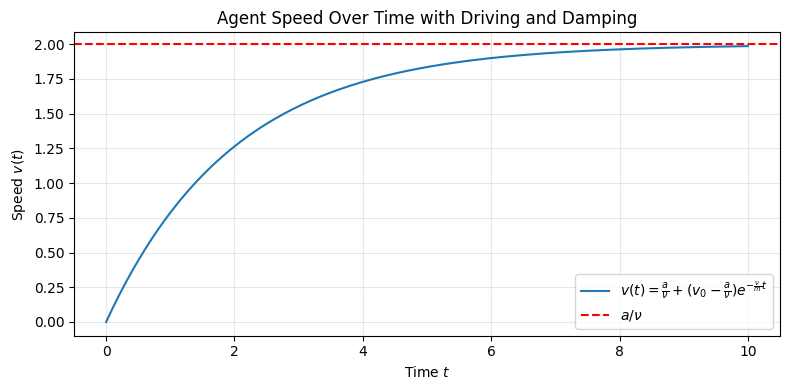
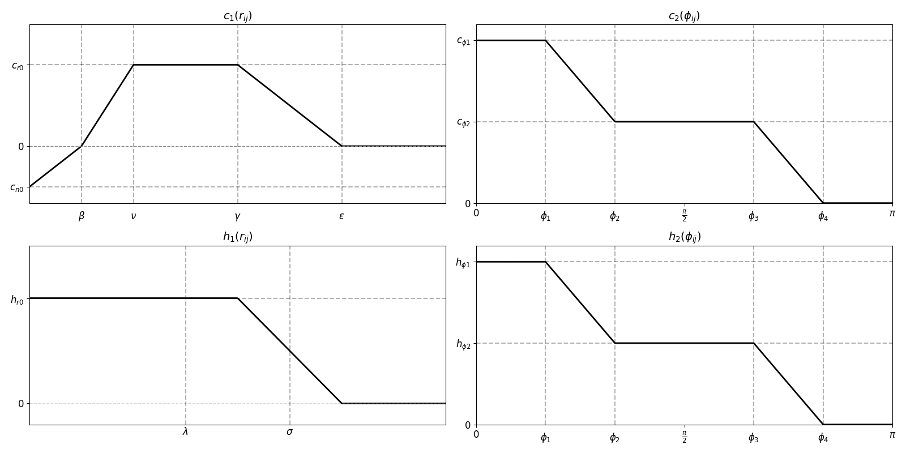
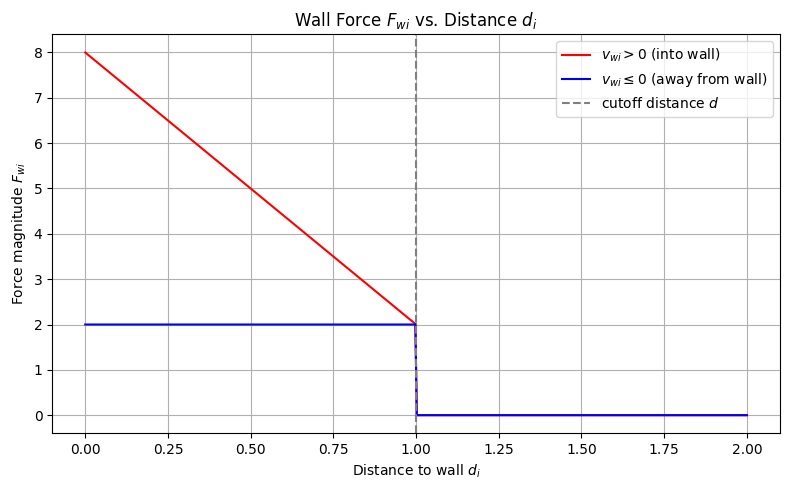
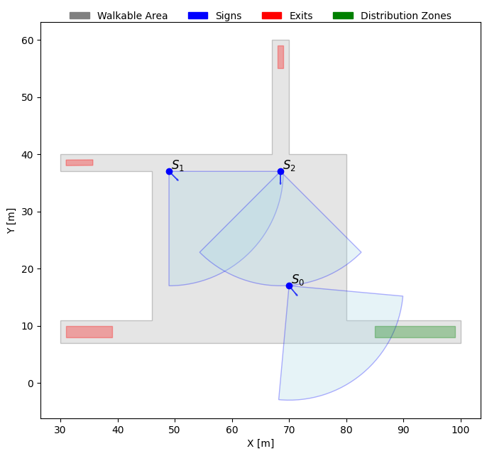

# Hirai and Tarui Crowd Simulation Model

This repository implements the pedestrian dynamics model proposed by **Hirai and Tarui** (1975) for simulating the behavior of crowds.

---

## Mathematical Model

The motion of each individual $i$ is governed by the following second-order differential equation:

$$F_{11} + F_{21} + F_{31}=m_i \ddot{x}_i+ \nu_i \dot{x}_i$$

Where:
- $x_i$ is the position vector
- $\dot{x}_i$ is the velocity
- $m_i$ is the mass
- $\nu_i$ is the viscosity (damping) coefficient
- $F_{11}$: social forces
- $F_{21}$: environmental forces
- $F_{31}$: random force due to disturbances

---

## Summary of forces

In the Hirai and Tarui model, there are **9 forces** explicitly defined, and they are grouped into three conceptual categories. 
Here's the full list:

### 🟦 Self-Motivated Force

| Symbol     | Name                | Equation in Paper | Description                                   |
|------------|---------------------|-------------------|-----------------------------------------------|
| $F_{a_i}$  | Self-driving force  | (3)               | Moves the agent forward at a constant desired speed. |

### 🟥 Interpersonal & Environmental Forces

| Symbol     | Name               | Equation | Description                                                  |
|------------|--------------------|----------|--------------------------------------------------------------|
| $F_{b_i}$  | Avoidance force    | (4)      | Repulsive force from nearby individuals.                     |
| $F_{c_i}$  | Cohesion force     | (5)      | Attractive force toward group members.                       |
| $F_{w_i}$  | Wall repulsion     | (8)      | Repulsion from walls; strength depends on distance and velocity component into the wall. |

### 🟩 Goal-Oriented Forces

| Symbol     | Name                     | Equation | Description                                                               |
|------------|--------------------------|----------|---------------------------------------------------------------------------|
| $F_{e_{ik}}$ | Visible sign attraction | (9)      | Attraction toward visible signs within field of view.                     |
| $F_{f_{ik}}$ | Memorized sign force    | (10)     | Attraction to previously seen signs even when no longer visible.          |
| $F_{g_i}$    | Exit force              | (4)      | Attraction toward exit if agent is within exit's effective radius.        |

### 🟨 External Influence & Noise

| Symbol     | Name                    | Equation | Description                                                |
|------------|-------------------------|----------|------------------------------------------------------------|
| $F_{h_i}$  | Herding force           | (10)     | External influence (e.g., crowd herding).                  |
| $F_{31}$   | Random fluctuation      | (11)     | Randomized fluctuation force depending on wall proximity. |

---

## Components of the Forces

### 1. **Social Force** $F_{11} = F_{ai} + F_{bi} + F_{ci}$

#### (a) Forward Driving Force:

$$F_{ai} = a \cdot \hat{x}_i$$

Pushes the individual forward in the direction of motion.

This function alone leads to a constant acceleration.
However, with the damping parameter $\nu_i$ the agents accelerate indeed to a constant speed.

The agent's velocity $v(t)$ follows from the equation of motion:

$$
m \frac{d\vec{v}}{dt} = a \frac{\vec{v}}{|\vec{v}|} - \nu \vec{v}
$$

Assuming motion in a fixed direction (i.e., constant direction of $\vec{v}$) and starting from $v(0) = 0$, the scalar form becomes:

$$
\frac{dv}{dt} = \frac{a}{m} - \frac{\nu}{m} v
$$

This is a linear first-order ODE with solution:

$$
v(t) = \frac{a}{\nu} \left(1 - e^{-\frac{\nu}{m}t} \right)
$$

where:
- $a$ is the magnitude of the driving force,
- $\nu$ is the damping coefficient,
- $m$ is the mass of the agent.

> Note: The similarity to the traditional driving force in force-based models, e.g. the social force model.
> Hereby,
> 
> $v^0 = \frac{a}{\mu}$ and  $\tau = \frac{m}{\mu}$

#### (b) Attraction / Repulsion:

$$F_{bi} = - \sum_j c(x_i, \dot{x}_i, x_j) \frac{x_j - x_i}{r^{ij}}$$

Attracts agents at a moderate distance, repels those that are too close.

$$c(x_i, \dot{x}_i, x_j) = c_1(r^{ij}) c_2(\theta^{ij})$$

#### (c) Velocity Matching (Alignment):

$$F_{ci} = - \frac{1}{M} \sum_j h(x_i, \dot{x}_i, x_j) \frac{x_j - x_i}{r^{ij}}$$

Encourages alignment of motion in local groups.

$$h(x_i, \dot{x}_i, x_j) = h_1(r^{ij}) h_2(\theta^{ij})$$

---

### 2. **Environmental Force** $F_{21}$

$$F_{21} = F_{wi} + \sum_k (F_{eik} + F_{fik}) + F_{gi} + F_{hi}$$

- **Wall Repulsion** $F_{wi}$:

Repels agents from walls:

Where:

- $\mathbf{e}_w$ is the unit vector pointing **away from the wall**
- $v_{wi}$ is the component of velocity **along $-\mathbf{e}_w$** (i.e., *into* the wall is positive)
- $d_i$ is the **actual distance** from the agent to the wall
- $d$ is the **cutoff distance**: the maximum range in which the wall force acts

This force **slows down the agent as they approach the wall**, and **acts only within a threshold distance**.

- **Attraction to Signs** $F_{eik}$:
  
$$F_{eik} = \eta \cdot  \frac{P_k - x_i}{|P_k - x_i|}$$

Attracts the agent toward visible guiding signs $P_k$.

- **Memory-Based Attraction to Signs** $F_{fik}$:
Same as $F_{eik}$, but persists after the sign is out of sight.

- **Exit Attraction** $F_{gi}$:

$$F_{gi} = g_i$$
Drives agents toward a known exit nearby.

### Summary of Region-Specific Forces

The model assumes that different forces act in mutually exclusive regions:

| Region                       | Active Forces                      |
|-----------------------------|------------------------------------|
| **Exit domain** (near exit) | `F_gi` (goal/exit attraction only) |
| **Visible sign domain**     | `F_eik` (only if sign is visible)  |
| **Memory domain**           | `F_fik` (only if sign was memorized) |
| **All other regions**       | Wall, social, cohesion, fluctuation forces |

> **Note**:  
`F_gi`, `F_eik`, and `F_fik` are **never active at the same time**.  
Each agent experiences only one of them depending on their location and memory state.

- **Panic Avoidance** $F_{hi}$:

$$F_{hi} = h_i$$

Pushes agents away from the panic origin.

---

### 3. **Random Force** $F_{31}$

Models stochastic disturbances:

$$F_{31} =
\begin{cases}
  q_1 \cdot \text{rand}() & \text{if } d_i > d \\
 -q_2 \cdot \text{rand}() & \text{if } d_i \leq d \text{ and } b_{wi} > 0 \\
 -q_1 \cdot \text{rand}() & \text{if } d_i \leq d \text{ and } b_{wi} \leq 0
\end{cases}
$$

Where `rand()` is a unit vector in a random direction.

---

## Implementation Notes
- Forces are modular Python functions for testing and reuse
- Agents interact with each other and with walls (modeled via Shapely)
- Basic Euler integration is used to update agent positions

---

## Future Extensions
- Calibration

## Simulation of the original scenario from the paper

The paper shows simulations of a passage:

https://github.com/user-attachments/assets/a68b7b05-6154-4a4a-bbce-4f33a5575c71

---

## References
- K. Hirai and K. Tarui, "A Simulation of the Behavior of a Crowd in Panic", Kobe University, 1975.
---

